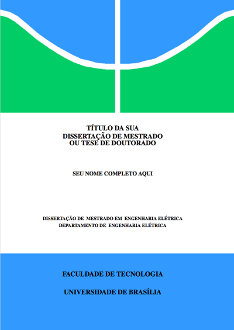

# Modelo em Latex para elaboração de monografias, dissertações e teses da Universidade de Brasília (UnB)
-------------------------------------------------------------------------------------------------------

Este é um modelo (template) Latex **NÃO OFICIAL** para elaboração de monografias, 
dissertações e teses da [Faculdade de Tecnologia (FT)](http://ftd.unb.br) da [UnB](http://unb.br). 
Esta é uma versão atualizada por [Manoel Campos](http://manoelcampos.com), adicionando recursos como "página de assinaturas" 
e organizando o código do template para que o mesmo não fique misturado com o conteúdo do documento escrito pelo acadêmico. 

Esta versão também removeu a necessidade de instalação do template em uma pasta específica do sistema, 
permitindo que ele fique dentro da pasta da dissertação/tese e tornando seu uso direto: 
basta baixar, fazer as alterações que desejar e compilar, desde que tenha uma distribuição Latex instalada 
(veja detalhes na seção a seguir). 
Além disso, a remoção da necessidade de instalação do template em uma pasta global específica para sistemas &#42;nix, 
permite o uso do mesmo em qualquer sistema operacional que tenha um compilador *PDFLatex*.

# Como utilizar o modelo para escrever sua monografia, dissertação ou tese

Para utilizar o modelo são necessários alguns softwares instalados em seu sistema operacional.
O modelo pode ser utilizado em Windows, Linux e macOS.
A seguir são apresentados mais detalhes.

## Editor de documentos LaTeX

Para criar e editar arquivos tex, apesar de não ser um pré-requisito, o mais recomendável é utilizar um editor LaTeX específico.
No entanto, pode-se editar os arquivos em qualquer editor de texto que suporte codificação de caracteres em UTF-8
(como o Notepad do Windows ou qualquer editor de texto nativo de sistemas Linux e macOS).

Existem diversas alternativas de editores, tanto gratuitos como pagos.
Um excelente editor que funciona em diversos sistemas operacionais
é o [TeXstudio](http://www.texstudio.org), que foi baseado em versões atualmente descontinuadas
do Texmaker e TexMakerX. 

## Pré-requisitos para compilar seu documento

Para compilar seu documento utilizando este modelo é preciso ter uma uma distribuição LaTeX instalada. 
Existem distribuições disponíveis para os sistemas operacionais mais conhecidos como Windows, Linux e macOS,
como será visto a seguir.

O compilador a ser utilizado, disponível após a instalação da distribuição LaTeX, é o *PDFLatex*, mas provavelmente pode
utilizar outros compiladores.

As sub-secções a seguir apresentam detalhes de instalação dos pré-requisitos para cada um dos sistemas operacionais em que o modelo foi testado.

### Usuários de Windows

Em sistemas Windows deve ser instalada a distribuição LaTeX denominada [MiKTeX](http://miktex.org).

### Usuários de Linux

Em sistemas Linux deve ser instalada a distribuição LaTeX denominada *texlive-full*.
A instalação pode ser feita por meio de ferramentas gráficas como a "Central de Software" disponível em sistemas
como Ubuntu, ou por meio do terminal utilizando um gerenciador de pacotes.

Diferentes distribuições Linux possuem seus próprios gerenciadores de pacote e cada usuário deve verificar qual
é o utilizado em seu sistema. No entanto, a seguir são mostrados alguns exemplos
de gerenciadores de pacotes, a serem executados a partir de um terminal, para distribuições Linux conhecidas.

- Debian e derivados (como Ubuntu e Linux Mint): `sudo apt-get install texlive-full`
- Red Hat e derivados (como Fedora e CentOS): `sudo yum install texlive-full`
- ArchLinux e derivados (como ArchBang): `sudo pacman install texlive-full`

### Usuários de macOS

Em sistemas macOS deve ser instalada a distribuição LaTeX denominada [MacTeX](https://tug.org/mactex/).

## Como compilar o seu documento para PDF

Para compilar seu documento para um arquivo PDF utilizando um editor latex como 
descrito nas seções acima, deve ser utilizado o compilador *PDFLaTeX* (normalmente definido como padrão nos editores). 

O local onde define-se o compilador padrão ou onde pode-se
escolher o compilador varia de acordo com o editor em uso.
Assim, verifique a documentação do seu editor para mais detalhes.

Para os programadores que são familiarizados com o terminal,
há um arquivo [Makefile](Makefile) que permite compilar o documento
por meio da linha de comando. Desta forma, tendo o programa *make* instalado
(que é padrão em sistemas Linux e macOS),
há os comandos abaixo disponíveis:

- **make** compila o documento; 
- **make clean** apaga todos os arquivos temporários criados no processo de compilação.

Se o nome do arquivo principal do seu trabalho for diferente de *principal.tex*,
para compilar utilizando o comando *make*, é preciso editar o arquivo [Makefile](Makefile) 
e informar o nome do documento tex principal na primeira linha do *Makefile*.

# Exemplo
Uma dissertação de exemplo utilizando o template [é disponibilizada juntamente com o projeto](principal.pdf).

# Estrutura do projeto
Depois de baixados os arquivos do projeto você terá a seguinte estrutura de pastas:
- **template-FT-UnB**: arquivos do template. A não ser que deseje fazer melhorias ou correções no template, 
  os arquivos desta pasta não devem ser modificados.
- **imagens**: pasta onde as imagens da sua monografia/dissertação/tese devem ser salvas para facilitar a organização

Os arquivos na raiz da pasta são arquivos de exemplo de uma dissertação de mestrado. 
O arquivo principal foi apropriadamente nomeado de [principal.tex](principal.tex). 
A partir dele é feita a compilação do documento. 
Cada arquivo .tex adicional é uma parte específica do documento de exemplo (como resumo, capítulos, conclusão, apêndices, etc). 
As referências a serem utilizadas devem estar no arquivo [referencias.bib](referencias.bib).

# Autor
Não sou o autor original deste projeto :relaxed:, fiz apenas a reestruturação do mesmo para facilitar o uso e impedir 
que comandos do template sejam misturados ao texto do documento.

Desta forma, os créditos pela autoria do projeto devem ser dados ao 
[Prof. D.Sc. Geovany Araujo Borges (UnB)](https://lara.unb.br/~gaborges/).

  
# Colaboradores
- Nathalie Pinheiro
- André Calmon
- Renan Utida
- [Manoel Campos da Silva Filho](http://manoelcampos.com) (eu :v: :smile:)

# Licença:
- [Attribution-NonCommercial-ShareAlike 3.0 Unported CC BY-NC-SA 3.0](http://creativecommons.org/licenses/by-nc-sa/3.0/)

